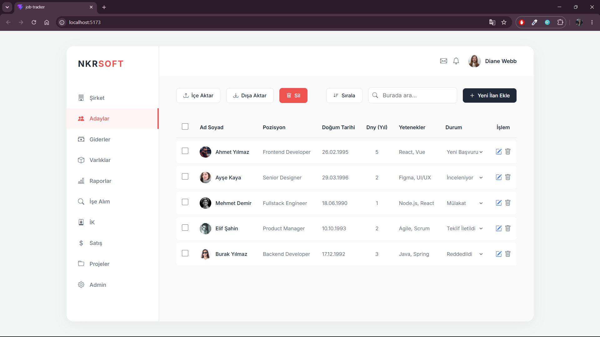

# İK Başvuru Yönetim Paneli (HR Dashboard)

Bu proje, bir İnsan Kaynakları (İK) uzmanının şirkete gelen iş başvurularını düzenli ve profesyonel bir şekilde yönetmesini sağlayan modern bir web uygulamasıdır.

## 🎯 Projenin Amacı
İşe alım sürecindeki adayların takibini kolaylaştırmak amacıyla tasarlanmıştır. İK uzmanları bu panel üzerinden;
- Sisteme yeni açılan ilanları ekleyebilir,
- Başvuran adayların listesini görüntüleyebilir,
- Adayların süreç durumlarını ("Yeni Başvuru", "Mülakat", "Teklif İletildi", "Reddedildi" vb.) tek tıkla güncelleyebilir,
- İhtiyaç duyulmayan aday kayıtlarını sistemden silebilir.

## 💻 Kullanılan Teknolojiler
Proje, hızlı ve modern web standartlarına uygun olarak geliştirilmiştir:
- **React.js**: Kullanıcı arayüzü ve bileşen mimarisi için kullanıldı.
- **Vite**: Hızlı geliştirme ortamı (HMR) ve verimli build süreçleri için tercih edildi.
- **CSS3 & Bootstrap Icons**: Minimalist, sade ve modern bir kullanıcı deneyimi (UI/UX) yaratmak için özel stiller ve ikonlar ile desteklendi.
- **LocalStorage**: Geçici veri saklama ve simülasyon işlemleri için kullanıldı.

---

